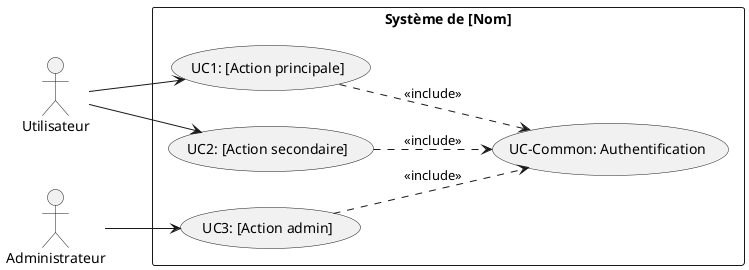
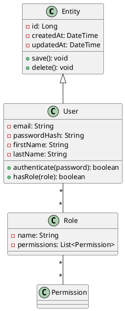
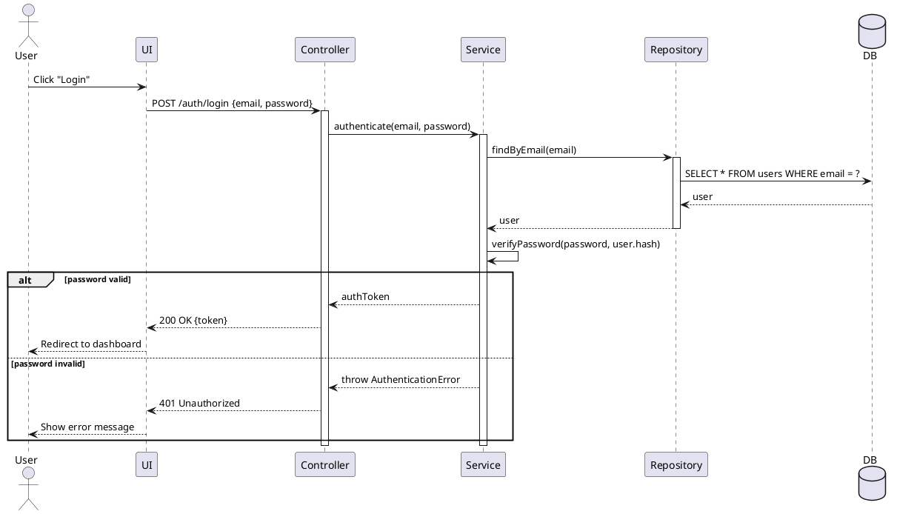

# Annexe A : Modèles UML et documentation technique

Cette annexe fournit des templates et exemples pour la modélisation UML et la documentation d'architecture.

---

## A.1 Templates de diagrammes UML

### A.1.1 Template Use Case Diagram



### A.1.2 Template Class Diagram



### A.1.3 Template Sequence Diagram



---

## A.2 Template Architecture Decision Record (ADR)

```markdown
# ADR-XXX: [Titre court de la décision]

## Statut
[Proposé | Accepté | Déprécié | Remplacé par ADR-YYY]

## Contexte
[Décrivez la situation qui nécessite une décision. Incluez:]
- Le problème à résoudre
- Les contraintes techniques ou business
- Les alternatives connues
- Les enjeux

Exemple: "Nous devons choisir une base de données pour stocker..."

## Décision
[Décrivez la décision prise de manière claire et concise]

Exemple: "Nous utiliserons PostgreSQL comme base de données principale."

## Conséquences

### Positives
- [Avantage 1]
- [Avantage 2]
- [Avantage 3]

### Négatives
- [Inconvénient 1]
- [Inconvénient 2]

### Risques
- [Risque identifié 1 + mitigation]
- [Risque identifié 2 + mitigation]

## Alternatives considérées

### Alternative 1: [Nom]
- **Pour:** [Avantages]
- **Contre:** [Inconvénients]
- **Pourquoi rejetée:** [Raison]

### Alternative 2: [Nom]
- **Pour:** [Avantages]
- **Contre:** [Inconvénients]
- **Pourquoi rejetée:** [Raison]

## Implémentation
[Notes techniques sur l'implémentation si pertinent]

## Date
[YYYY-MM-DD]

## Participants
- [Nom 1] - [Rôle]
- [Nom 2] - [Rôle]

## Références
- [Lien vers documentation]
- [Lien vers discussions]
```

---

## A.3 Template documentation d'architecture (C4 Model)

### Niveau 1: Context

```markdown
# Diagramme de Contexte - [Nom du Système]

## Vue d'ensemble
[Description courte du système et de son objectif]

## Acteurs externes
1. **[Nom acteur 1]** (Personne/Système)
   - Description: [Qui/Quoi]
   - Interaction: [Comment il utilise le système]

2. **[Nom acteur 2]** (Personne/Système)
   - Description: [Qui/Quoi]
   - Interaction: [Comment il utilise le système]

## Systèmes externes
1. **[Nom système 1]**
   - Description: [Ce qu'il fait]
   - Intégration: [Comment notre système communique]

## Flux principaux
[Diagramme C4 Context + explication des flux majeurs]
```

### Niveau 2: Container

```markdown
# Diagramme de Conteneurs - [Nom du Système]

## Conteneurs applicatifs

### Web Application
- **Technologie:** React + TypeScript
- **Responsabilités:**
  - Interface utilisateur
  - Validation côté client
  - State management
- **Communication:**
  - Appelle API REST backend
  - WebSocket pour temps réel

### API Backend
- **Technologie:** Node.js + Express
- **Responsabilités:**
  - Logique métier
  - Validation serveur
  - Authentification/Autorisation
- **Communication:**
  - REST API vers Frontend
  - Requêtes vers PostgreSQL
  - Pub/Sub vers Redis

### Base de données
- **Technologie:** PostgreSQL 14
- **Responsabilités:**
  - Persistance données
  - Transactions ACID
- **Configuration:**
  - Master/Replica pour reads

[Diagramme C4 Container]
```

---

## A.4 Template spécification technique

```markdown
# Spécification Technique - [Nom Fonctionnalité]

## Identification
- **Feature ID:** F-XXX
- **Version:** 1.0
- **Date:** YYYY-MM-DD
- **Auteur:** [Nom]
- **Status:** [Draft | Review | Approved]

## Objectif
[Description concise de la fonctionnalité et de sa valeur]

## Exigences fonctionnelles
RF-001: [Description]
RF-002: [Description]

## Exigences non fonctionnelles
RNF-001: Performance (< 500ms)
RNF-002: Sécurité (HTTPS, JWT)

## Conception

### Diagrammes
[Insérer: use case, séquence, classes]

### Modèle de données
\```sql
CREATE TABLE ...
\```

### API Endpoints

#### POST /api/resource
**Description:** [Ce que fait l'endpoint]

**Request:**
\```json
{
  "field1": "value",
  "field2": 123
}
\```

**Response 201:**
\```json
{
  "id": 1,
  "field1": "value",
  "createdAt": "2024-10-21T10:00:00Z"
}
\```

**Errors:**
- 400: Validation error
- 401: Unauthorized
- 409: Resource already exists

### Règles métier
1. [Règle 1]
2. [Règle 2]

## Implémentation

### Fichiers modifiés/créés
- `src/controllers/resourceController.js` (nouveau)
- `src/services/resourceService.js` (nouveau)
- `src/models/Resource.js` (nouveau)
- `src/routes/resourceRoutes.js` (modifié)

### Dépendances
- Aucune nouvelle dépendance

OU

- Package X v2.3.0 (pour feature Y)

## Tests

### Scénarios de test
1. **Test nominal:**
   - Given: [Préconditions]
   - When: [Action]
   - Then: [Résultat attendu]

2. **Test erreur:**
   - Given: [Préconditions]
   - When: [Action]
   - Then: [Erreur attendue]

### Couverture cible
- Unitaire: 90%
- Intégration: 80%

## Sécurité
- [ ] Validation des entrées
- [ ] Authentification requise
- [ ] Autorisation par rôle
- [ ] Audit log
- [ ] Données sensibles chiffrées

## Performance
- **Temps de réponse cible:** < 500ms
- **Throughput:** 100 req/s minimum

## Migration/Déploiement

### Migration base de données
\```sql
-- V001__Create_resource_table.sql
CREATE TABLE ...
\```

### Configuration requise
\```env
NEW_FEATURE_ENABLED=true
RESOURCE_CACHE_TTL=3600
\```

### Plan de rollback
[Comment revenir en arrière si problème]

## Documentation
- [ ] API documentation mise à jour
- [ ] README mis à jour
- [ ] Changelog mis à jour
- [ ] Formation utilisateurs si nécessaire

## Validation
- [ ] Revue de code
- [ ] Tests passants
- [ ] Demo au Product Owner
- [ ] Approbation finale
```

---

## A.5 Glossaire technique

```markdown
# Glossaire - Projet [Nom]

## Acronymes

**API:** Application Programming Interface
**CRUD:** Create, Read, Update, Delete
**DTO:** Data Transfer Object
**JWT:** JSON Web Token
**ORM:** Object-Relational Mapping
**REST:** Representational State Transfer
**SPA:** Single Page Application

## Termes métier

**[Terme 1]:**
Définition: [Explication claire]
Contexte: [Où/comment utilisé]
Exemple: [Exemple concret]

**[Terme 2]:**
...

## Termes techniques

**Repository:**
Définition: Couche d'accès aux données abstrayant la source
Contexte: Pattern utilisé dans architecture en couches
Exemple: UserRepository encapsule les requêtes SQL

**Aggregate:**
Définition: Groupe d'objets traités comme une unité (DDD)
Contexte: Garantit cohérence des invariants métier
Exemple: Order est un agrégat contenant OrderItems
```

---

[⬅️ Partie VII](./README.md) | [➡️ Annexe B](./annexe-b-templates-tests-rapports.md)

